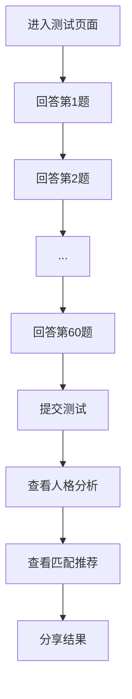

## 1. Product Overview
说唱歌手人格测试是一个互动式网页应用，通过60道题目评估用户的人格特质，并提供个性化的说唱歌手人格分析和匹配推荐。
- 主要目的是帮助用户了解自己的人格特质，并获得与说唱歌手风格的匹配度分析
- 目标用户为说唱音乐爱好者和对人格测试感兴趣的年轻人

## 2. Core Features

### 2.1 User Roles
| Role | Registration Method | Core Permissions |
|------|---------------------|------------------|
| Normal User | No registration required | Complete test, view results, share results |

### 2.2 Feature Module
1. **测试页面**: 60道题目展示，答题界面，进度显示
2. **结果页面**: 人格分析，条形图展示，匹配推荐

### 2.3 Page Details
| Page Name | Module Name | Feature description |
|-----------|-------------|---------------------|
| 测试页面 | 题目展示 | 显示当前题目，提供是/否选项或情景题选项，自动跳转下一题 |
| 测试页面 | 导航控制 | 仅显示上一题按钮，防止用户跳过题目 |
| 测试页面 | 进度指示 | 显示当前题目序号和总题数，提供视觉进度反馈 |
| 测试页面 | 验证提示 | 未选择答案时给出提示，确保每道题都被回答 |
| 结果页面 | 人格解析 | 显示16人格类型的解析图标，提供详细解读 |
| 结果页面 | 数据可视化 | 使用条形图展示各维度得分情况 |
| 结果页面 | 匹配推荐 | 提供职业适配和伴侣类型推荐 |
| 结果页面 | 分享功能 | 允许用户分享测试结果到社交媒体 |

## 3. Core Process
用户进入测试页面 → 依次回答60道题目 → 提交测试 → 查看个人格分析结果 → 查看匹配推荐 → 分享结果

## 4. User Interface Design
### 4.1 Design Style
- 主色调：低饱和柔和色，如浅紫色、淡蓝色、柔和的粉色
- 按钮风格：圆角设计，轻微的3D效果，悬停时有柔和的动画
- 字体：现代无衬线字体，如Inter或Poppins
- 布局风格：卡片式布局，清晰的视觉层次
- 图标风格：简约线条图标，与整体风格协调

### 4.2 Page Design Overview
| Page Name | Module Name | UI Elements |
|-----------|-------------|-------------|
| 测试页面 | 题目展示 | 卡片式容器，柔和的阴影，清晰的题目文字，选项按钮采用低饱和色 |
| 测试页面 | 导航控制 | 上一题按钮位于左侧，采用次要色调，点击时有反馈动画 |
| 测试页面 | 进度指示 | 顶部进度条，显示当前题目序号/总题数，颜色与主题一致 |
| 结果页面 | 人格解析 | 中央大图标，下方详细文字解析，使用卡片式布局 |
| 结果页面 | 数据可视化 | 响应式条形图，颜色渐变，清晰的标签和数值 |
| 结果页面 | 匹配推荐 | 卡片式布局，分类展示职业和伴侣类型推荐 |

### 4.3 Responsiveness
- 移动端优先设计，适配各种屏幕尺寸
- 触摸友好的界面元素，按钮尺寸适合手指点击
- 响应式布局，在不同设备上保持良好的用户体验

### 4.4 3D Scene Guidance
- 无3D场景需求，专注于2D界面的交互和视觉效果