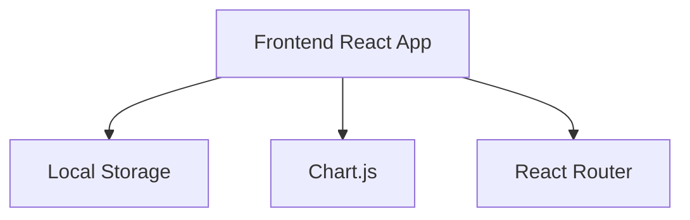
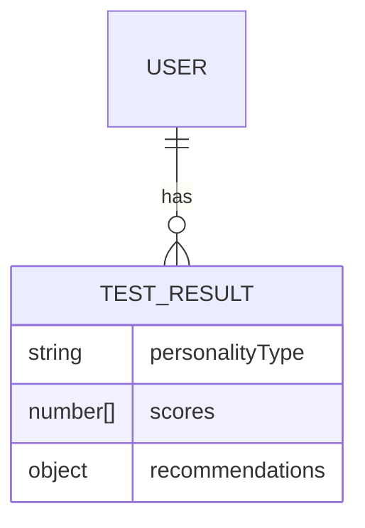

## 1. Architecture Design


## 2. Technology Description
- Frontend: React@18 + tailwindcss@3 + vite
- Initialization Tool: vite-init
- Backend: None (纯前端实现)
- Database: Local Storage (存储测试结果)
- Charting Library: Chart.js (用于数据可视化)

## 3. Route Definitions
| Route | Purpose |
|-------|---------|
| / | 测试页面 |
| /result | 结果页面 |

## 4. API Definitions
- 无后端API需求，所有逻辑在前端实现

## 5. Server Architecture Diagram
- 无后端架构需求

## 6. Data Model
### 6.1 Data Model Definition


### 6.2 Data Definition Language
- 无数据库需求，使用Local Storage存储测试结果
- 测试结果结构：
  ```javascript
  {
    personalityType: "ENFP", // 16人格类型
    scores: [90, 75, 80, 65], // 各维度得分
    recommendations: {
      career: ["音乐制作人", "说唱歌手", "创意总监"],
      partner: ["ENTP", "INFP", "ENFJ"]
    }
  }
  ```